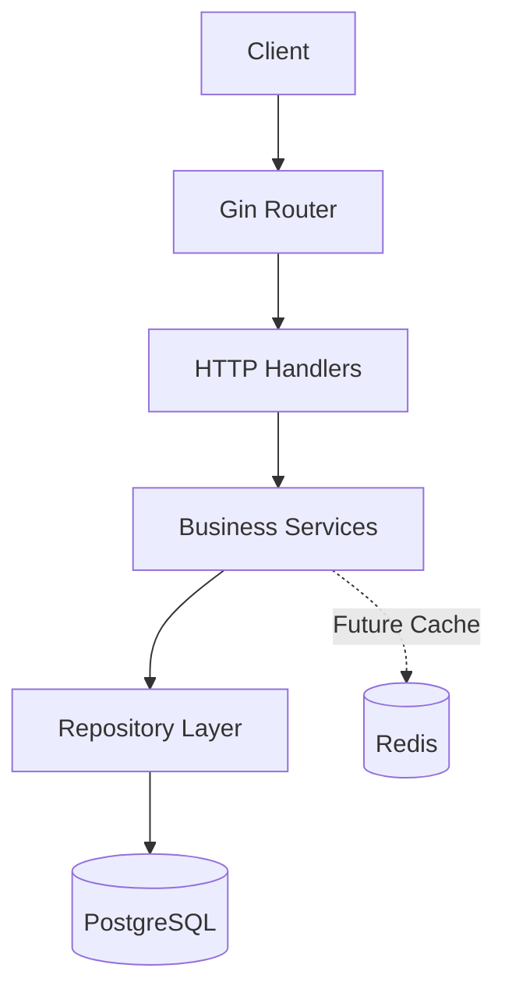
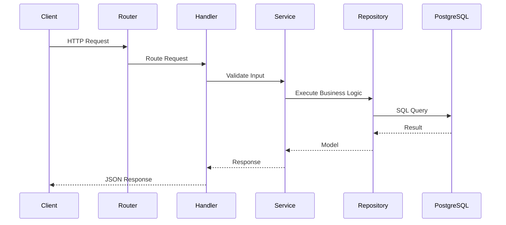
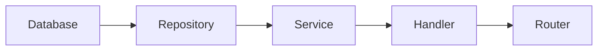
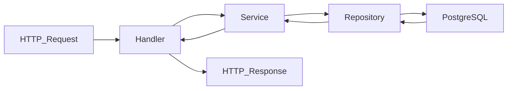
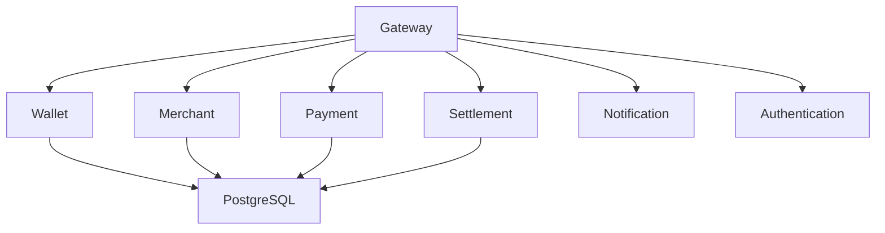

# 🏛 KongPay Architecture

KongPay is built using **Clean Architecture**, **Dependency Injection**, and the **Repository Pattern**.

The goal is to keep business logic independent from infrastructure so that the application remains maintainable, testable, and scalable.

---

# 🎯 Design Principles

- API First
- Clean Architecture
- SOLID Principles
- Repository Pattern
- Dependency Injection
- Stateless Services
- Cloud Native
- Docker Ready
- Production Ready

---

# 🏗 High-Level Architecture



---

# 📡 Request Flow



---

# 🧱 Project Layers

```text
Client
│
▼
Gin Router
│
▼
HTTP Handler
│
▼
Service Layer
│
▼
Repository Layer
│
▼
PostgreSQL
```

---

# 📋 Layer Responsibilities

| Layer | Responsibility |
|--------|----------------|
| Client | Sends HTTP requests |
| Router | Maps endpoints to handlers |
| Handler | Request binding and response formatting |
| Service | Business logic and validation |
| Repository | Database access |
| PostgreSQL | Persistent storage |
| Redis | Future caching and coordination |

---

# 📂 Project Structure

```text
kongpay/
│
├── cmd/
│   └── kongpay/
│       └── main.go
│
├── internal/
│   ├── config/
│   ├── database/
│   ├── handlers/
│   ├── middleware/
│   ├── models/
│   ├── repositories/
│   ├── router/
│   ├── services/
│   └── utils/
│
├── migrations/
├── docker/
├── docs/
├── tests/
├── .github/
│
├── docker-compose.yml
├── go.mod
├── go.sum
└── README.md
```

---

# 🔄 Dependency Injection



The application wires dependencies in the following order:

1. Connect PostgreSQL.
2. Create repositories.
3. Create services.
4. Create handlers.
5. Register HTTP routes.
6. Start the Gin server.

---

# 🗄 Data Flow



---

# 🔐 Authentication Flow (Planned)


---

# 🌐 Future Microservice Architecture



---

# 🛠 Current Components

| Component | Status |
|------------|:------:|
| Router | ✅ |
| Wallet Handler | ✅ |
| Wallet Service | ✅ |
| Wallet Repository | ✅ |
| PostgreSQL | ✅ |
| Redis | ✅ |
| Docker | ✅ |
| Health Endpoint | ✅ |

---

# 🚧 Planned Components

| Component | Status |
|------------|:------:|
| JWT Authentication | 🚧 |
| Swagger/OpenAPI | 🚧 |
| SQL Migration | 🚧 |
| Merchant Service | ⏳ |
| Payment Engine | ⏳ |
| Ledger | ⏳ |
| Settlement | ⏳ |
| QRIS Integration | ⏳ |

---

# 🚀 Scalability Vision

KongPay is designed to evolve from a modular monolith into a collection of independent services while preserving a consistent API-first approach.

Future enhancements include:

- Kubernetes Deployment
- API Gateway
- Horizontal Scaling
- Distributed Caching
- Observability
- Metrics & Monitoring
- Event-Driven Messaging
- High Availability

---

# ❤️ Architecture Philosophy

> **Keep business logic independent of infrastructure, build modular services, and scale through clean abstractions.**
