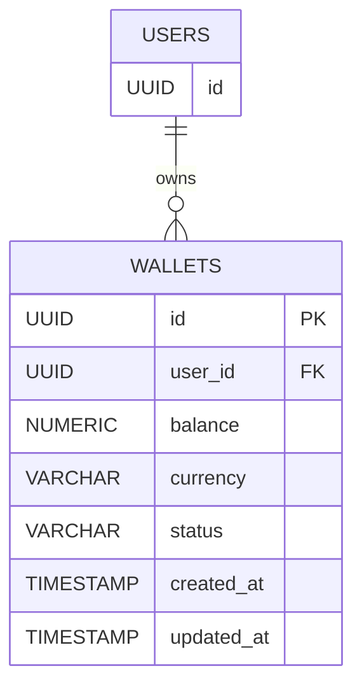
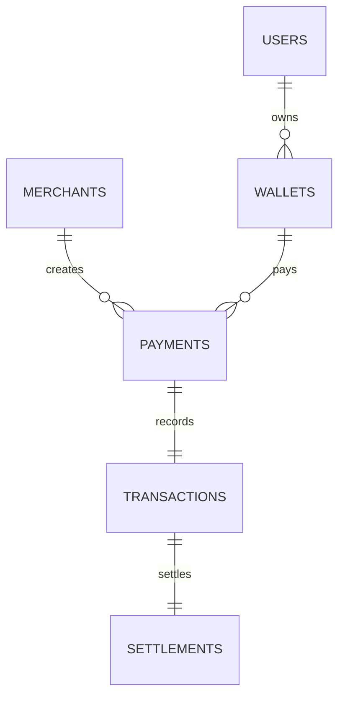

# 🗄 KongPay Database Design

KongPay uses **PostgreSQL 17** as the primary relational database.

The database is designed using a modular approach to support wallets, merchants, payments, settlements, and future financial services.

---

# 🎯 Design Principles

- Relational Database
- ACID Transactions
- UUID Primary Keys
- Normalized Schema
- Referential Integrity
- Scalable Structure
- Production Ready

---

# 🏗 Current Database Architecture



---

# 📋 Current Tables

| Table | Purpose | Status |
|---------|---------|:------:|
| wallets | Digital wallet storage | ✅ |

---

# 🗄 Wallet Table

```sql
CREATE TABLE wallets (
    id UUID PRIMARY KEY,
    user_id UUID NOT NULL,
    balance NUMERIC(20,2) NOT NULL DEFAULT 0,
    currency VARCHAR(10) NOT NULL,
    status VARCHAR(20) NOT NULL DEFAULT 'ACTIVE',
    created_at TIMESTAMP NOT NULL DEFAULT NOW(),
    updated_at TIMESTAMP NOT NULL DEFAULT NOW()
);
```

---

# 🔍 Indexes

```sql
CREATE INDEX idx_wallets_user_id
ON wallets(user_id);

CREATE INDEX idx_wallets_status
ON wallets(status);
```

---

# 📊 Wallet Columns

| Column | Type | Description |
|---------|------|-------------|
| id | UUID | Primary key |
| user_id | UUID | Wallet owner |
| balance | NUMERIC(20,2) | Wallet balance |
| currency | VARCHAR(10) | Currency code |
| status | VARCHAR(20) | Wallet status |
| created_at | TIMESTAMP | Creation time |
| updated_at | TIMESTAMP | Last update |

---

# 🔄 CRUD Operations

| Operation | SQL |
|------------|-----|
| Create | INSERT |
| Read | SELECT |
| Update | UPDATE |
| Delete | DELETE |

---

# 📈 Current Relationships

```text
User
 │
 └──────── owns ───────► Wallet
```

---

# 🚧 Planned Database Schema



---

# 🗂 Future Tables

| Table | Purpose |
|---------|----------|
| users | User identities |
| merchants | Merchant information |
| payments | Payment records |
| transactions | Ledger |
| settlements | Settlement records |
| api_keys | Merchant API keys |
| webhooks | Webhook endpoints |
| audit_logs | Audit events |
| refresh_tokens | JWT refresh tokens |

---

# 🔐 Data Integrity

Current constraints include:

- UUID primary keys
- NOT NULL columns
- Default values
- Indexed search fields

Future improvements:

- Foreign Keys
- Check Constraints
- Cascading Rules
- Unique Constraints

---

# 🚀 Migration Strategy

Future database migrations will be managed using SQL migration files.

```text
migrations/

001_create_wallets.sql

002_create_merchants.sql

003_create_payments.sql

004_create_transactions.sql

005_create_settlements.sql
```

---

# 💾 Backup Strategy

Planned backup policy:

- Daily automated backups
- Point-in-Time Recovery (PITR)
- Offsite encrypted backup
- Disaster recovery procedures

---

# 📈 Scaling Strategy

Current:

- Single PostgreSQL Instance

Future:

- Read Replicas
- Connection Pooling
- Partitioning
- High Availability
- Horizontal Scaling

---

# 🛠 Database Technology

| Component | Technology |
|------------|------------|
| Database | PostgreSQL 17 |
| Driver | pgx v5 |
| Identifier | UUID |
| ORM | None (Native SQL) |
| Migration | Planned |
| Cache | Redis 7 |

---

# ❤️ Database Philosophy

> **Keep the schema simple, strongly typed, normalized, and easy to evolve through versioned migrations.**
