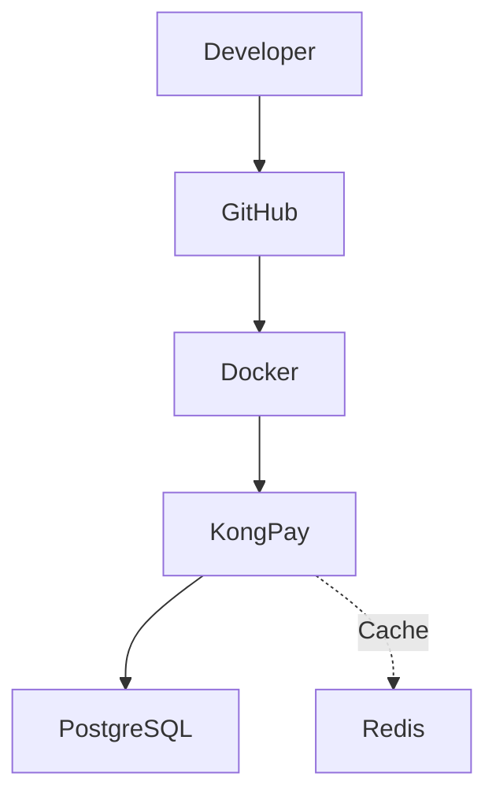
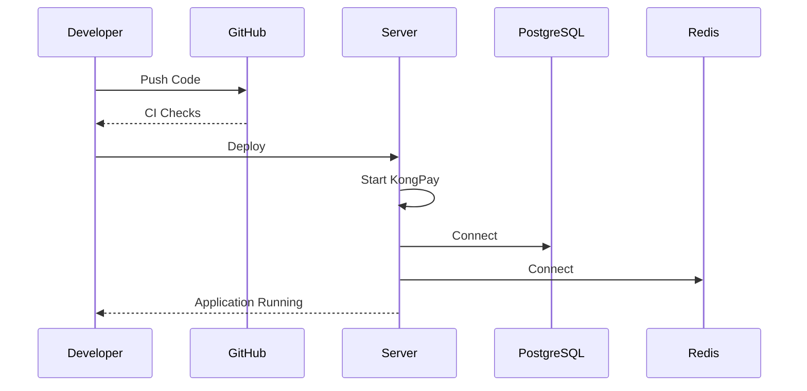

# 🚀 KongPay Deployment Guide

This document describes how to deploy **KongPay** for local development and outlines the path toward a production deployment.

---

# 📋 Prerequisites

Install the following software before running KongPay:

| Software | Recommended Version |
|----------|---------------------|
| Go | 1.26+ |
| Git | Latest |
| Docker | Latest |
| Docker Compose | Latest |
| PostgreSQL | 17 |
| Redis | 7 |

Verify your installation:

```bash
go version
docker --version
docker compose version
git --version
```

---

# 📥 Clone Repository

```bash
git clone https://github.com/kongali1720/KongPay.git

cd KongPay
```

---

# ⚙ Environment Configuration

Create a `.env` file.

Example:

```env
APP_NAME=KongPay
APP_ENV=development
PORT=8080

DB_HOST=localhost
DB_PORT=5432
DB_NAME=kongpay
DB_USER=postgres
DB_PASSWORD=postgres
DB_SSLMODE=disable

REDIS_HOST=localhost
REDIS_PORT=6379
```

> Do not commit production credentials or secrets.

---

# 🐳 Start Development Infrastructure

Start PostgreSQL and Redis:

```bash
docker compose up -d
```

Verify:

```bash
docker ps
```

View logs:

```bash
docker compose logs
```

Stop services:

```bash
docker compose down
```

---

# ▶ Run KongPay

```bash
go run ./cmd/kongpay
```

Expected output:

```text
✅ PostgreSQL Connected
🚀 KongPay running on :8080
```

---

# ❤️ Health Check

```bash
curl http://localhost:8080/health
```

---

# 👛 Test Wallet API

Create Wallet

```bash
curl -X POST http://localhost:8080/api/v1/wallets \
-H "Content-Type: application/json" \
-d '{
  "user_id":"550e8400-e29b-41d4-a716-446655440000",
  "currency":"IDR"
}'
```

List Wallets

```bash
curl http://localhost:8080/api/v1/wallets
```

---

# 🛠 Development Workflow

Format source code:

```bash
go fmt ./...
```

Run tests:

```bash
go test ./...
```

Build project:

```bash
go build ./...
```

Run application:

```bash
go run ./cmd/kongpay
```

---

# 📂 Deployment Architecture



---

# 🔄 Deployment Flow



---

# 🌍 Production Roadmap

Planned production deployment improvements:

- Reverse Proxy (Nginx or Caddy)
- HTTPS / TLS
- Environment Secret Management
- SQL Migrations
- Structured Logging
- Metrics & Monitoring
- Health Probes
- Automated Backups
- Horizontal Scaling
- Kubernetes Deployment

---

# 📈 Deployment Checklist

Before deployment:

- Go builds successfully
- Docker containers are healthy
- Database is reachable
- Redis is reachable
- Environment variables configured
- Health endpoint responds correctly

---

# 🔒 Security Checklist

Recommended practices:

- Enable HTTPS
- Protect secrets
- Restrict database access
- Use least-privilege accounts
- Keep dependencies updated
- Monitor application logs

---

# 💾 Backup Strategy

Recommended production strategy:

- Daily database backups
- Encrypted backup storage
- Periodic restore testing
- Disaster recovery procedures

---

# 🚀 Scaling Strategy

Current:

- Single application instance
- Single PostgreSQL instance
- Single Redis instance

Future:

- Load Balancer
- Multiple API instances
- PostgreSQL Read Replicas
- Redis Cluster
- Kubernetes
- Auto Scaling

---

# 📌 Deployment Status

| Component | Status |
|-----------|:------:|
| Go Application | ✅ |
| Gin Router | ✅ |
| PostgreSQL | ✅ |
| Redis | ✅ |
| Docker Compose | ✅ |
| Health Endpoint | ✅ |
| Wallet CRUD | ✅ |
| Reverse Proxy | 🚧 |
| HTTPS | 🚧 |
| Kubernetes | ⏳ |

---

# ❤️ Deployment Philosophy

> **Deploy consistently, automate wherever practical, and keep environments reproducible from development to production.**
