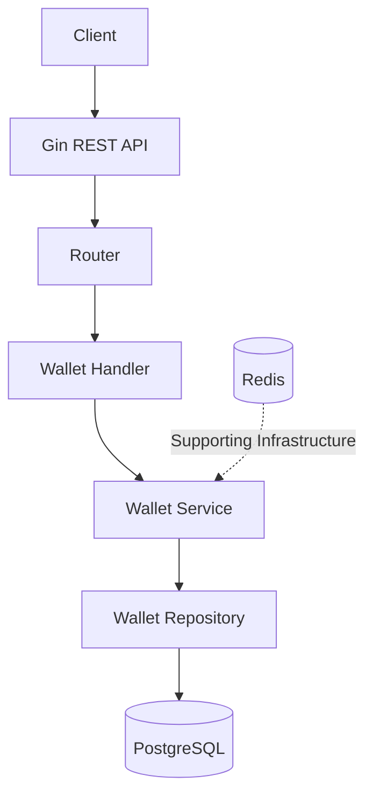
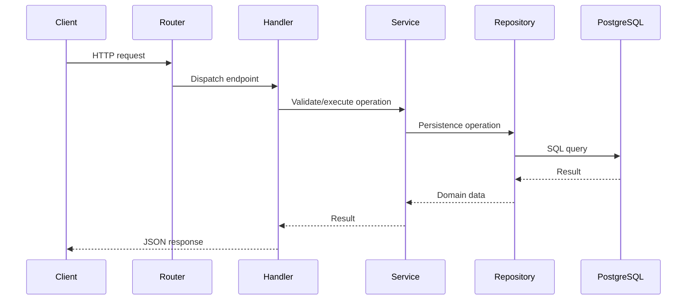
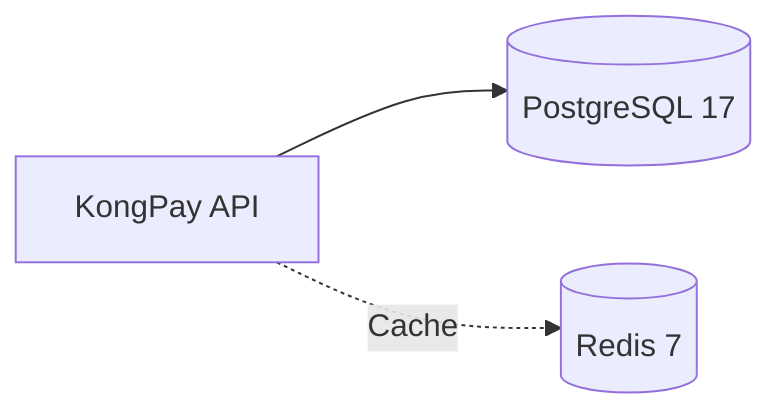

<p align="center">

</p>

<p align="center">

</p>

<h1 align="center">
KONGPAY
</h1>

<p align="center">
<b>Autonomous Digital Financial Infrastructure</b><br>
Open Source • API First • Cloud Native • Modular Architecture
</p>

---

<p align="center">


</p>

<p align="center">


</p>

<p align="center">


</p>

<p align="center">


</p>

---

# 🚀 Executive Summary

**KongPay** is an open-source payment infrastructure built with **Go**, designed to provide a modular, scalable, and secure foundation for modern financial applications. It is designed around modular backend components that can evolve into wallet, merchant, payment, ledger, settlement, notification, and financial API services.

The current implementation establishes a working Wallet REST API backed by PostgreSQL. The application is organized into handler, service, repository, model, database, configuration, and routing layers so that business logic and persistence concerns remain separated as the project grows.

KongPay emphasizes API-first development, modularity, maintainability, database-backed persistence, containerized development infrastructure, and automated CI checks.

> **Development notice:** KongPay is under active development. Features marked as planned or in progress in this README should not be interpreted as production-complete financial services.

---

# 🌍 Why KongPay?

Modern payment ecosystems require scalable and secure backend infrastructure. Digital payment systems typically involve many distinct concerns: account balances, merchants, transactions, authentication, settlement, auditability, integrations, infrastructure, and operational controls.

KongPay aims to provide reusable financial service components that developers and organizations can extend without building everything from scratch. The platform explores how those concerns can be separated into reusable services and clean application layers instead of being concentrated in one tightly coupled codebase.

KongPay focuses on:
* Security
* Scalability
* Performance
* Simplicity
* Developer Experience
* Maintainability
* Extensible financial-service architecture
* Open Source Collaboration

---

# 🎯 Project Goals

* Build reusable payment infrastructure & components
* Develop a production-ready Wallet Service
* Maintain a clean Go backend architecture
* Add secure identity and authentication capabilities
* Develop merchant-management APIs & provide Merchant APIs
* Build Transaction Ledger & introduce a transaction ledger
* Develop Settlement Engine & develop payment and settlement workflows
* Add documented integration interfaces
* Support JWT Authentication
* Support QRIS & Virtual Account integration
* Improve testing, migrations, deployment, and CI/CD over successive releases
* Encourage Open Source Collaboration

---

# 📊 Project Status

| Capability | Status |
| :--- | :--- |
| Go Backend | ✅ Implemented |
| Gin REST API | ✅ Implemented |
| PostgreSQL Connection | ✅ Implemented |
| Wallet Persistence | ✅ Implemented |
| Wallet CRUD | ✅ Implemented & Tested |
| Redis Container / Infrastructure | ✅ Available |
| Docker Development Infrastructure | ✅ Available |
| GitHub Actions | ✅ Available |
| JWT Authentication | 🚧 Planned |
| Swagger / OpenAPI | 🚧 Planned |
| SQL Migration Workflow | 🚧 Planned |
| Automated Unit Tests | 🚧 Planned |
| Merchant Service | ⏳ Roadmap |
| Payment Engine | ⏳ Roadmap |
| Transaction Ledger | ⏳ Roadmap |
| Settlement Service | ⏳ Roadmap |
| QRIS Integration | ⏳ Roadmap |
| Virtual Account Integration | ⏳ Roadmap |

---

# 🏗 Architecture

The Wallet request path implemented today is:

```text
HTTP Request
     │
     ▼
Gin Router
     │
     ▼
Wallet Handler
     │
     ▼
Wallet Service
     │
     ▼
Wallet Repository
     │
     ▼
PostgreSQL
```






---

# ✨ Current Features

- ✅ RESTful Wallet API
- ✅ Create Wallet
- ✅ List Wallets
- ✅ Get Wallet by ID
- ✅ Update Wallet
- ✅ Delete Wallet
- ✅ PostgreSQL Persistence
- ✅ UUID Wallet Identifiers
- ✅ Wallet Balance, Currency & Status
- ✅ Repository Pattern
- ✅ Service Layer
- ✅ Handler Layer
- ✅ Dependency Injection
- ✅ Environment-Based Configuration
- ✅ Health Check Endpoint
- ✅ Docker-based PostgreSQL & Redis Development Environment
- ✅ GitHub Actions CI

---

# ⚙ Technology Stack

| Layer | Technology |
|--------|------------|
| **Language** | Go 1.26 |
| **HTTP Framework** | Gin |
| **Database** | PostgreSQL 17 |
| **PostgreSQL Driver** | pgx v5 |
| **Cache** | Redis 7 |
| **Identifiers** | Google UUID |
| **Containers** | Docker |
| **CI/CD** | GitHub Actions |
| **API Style** | REST |
| **Version Control** | Git |

---

## 📂 Repository Structure

```text
kongpay/
│
├── cmd/
│   └── kongpay/
│       └── main.go
│
├── internal/
│   ├── config/
│   ├── database/
│   ├── handlers/
│   ├── middleware/
│   ├── models/
│   ├── repositories/
│   ├── router/
│   ├── services/
│   └── utils/
│
├── migrations/
├── docker/
├── docs/
├── tests/
├── .github/
│   └── workflows/
│
├── docker-compose.yml
├── go.mod
├── go.sum
└── README.md
```

### 📁 Directory Overview

| Directory | Purpose |
|-----------|---------|
| `cmd/kongpay` | Application entry point (`main.go`) |
| `internal/config` | Environment and application configuration |
| `internal/database` | PostgreSQL connection management |
| `internal/handlers` | HTTP request handlers |
| `internal/middleware` | HTTP middleware |
| `internal/models` | Domain models and entities |
| `internal/repositories` | Database access layer |
| `internal/router` | API route definitions |
| `internal/services` | Business logic layer |
| `internal/utils` | Shared helper functions |
| `migrations` | SQL database migrations |
| `docker` | Docker configuration files |
| `docs` | Project documentation |
| `tests` | Unit and integration tests |
| `.github/workflows` | GitHub Actions CI/CD workflows |

---

---

# 📋 Layer Responsibilities

| Layer | Responsibility |
|--------|----------------|
| `cmd/kongpay` | Application entry point (`main.go`) |
| `internal/config` | Environment and application configuration |
| `internal/database` | PostgreSQL connection lifecycle |
| `internal/handlers` | HTTP request and response handling |
| `internal/models` | Domain models and entities |
| `internal/repositories` | Database persistence operations |
| `internal/services` | Business and application logic |
| `internal/router` | API routing and dependency injection |
| `internal/middleware` | Cross-cutting HTTP middleware |
| `migrations` | SQL database migration scripts |
| `docs` | Project documentation |
| `tests` | Unit and integration tests |

---

# 🗄 Database Schema

The current Wallet Service uses the following database schema.

```sql
CREATE TABLE wallets (
    id UUID PRIMARY KEY,
    user_id UUID NOT NULL,
    balance NUMERIC(20,2) NOT NULL DEFAULT 0,
    currency VARCHAR(10) NOT NULL,
    status VARCHAR(20) NOT NULL DEFAULT 'ACTIVE',
    created_at TIMESTAMP NOT NULL DEFAULT NOW(),
    updated_at TIMESTAMP NOT NULL DEFAULT NOW()
);

CREATE INDEX idx_wallets_user_id
ON wallets(user_id);

CREATE INDEX idx_wallets_status
ON wallets(status);
```

## Wallet Table

| Column | Type | Description |
|--------|------|-------------|
| `id` | UUID | Primary key |
| `user_id` | UUID | Wallet owner |
| `balance` | NUMERIC(20,2) | Current wallet balance |
| `currency` | VARCHAR(10) | Wallet currency (IDR, USD, etc.) |
| `status` | VARCHAR(20) | Wallet status (ACTIVE, BLOCKED, CLOSED) |
| `created_at` | TIMESTAMP | Record creation time |
| `updated_at` | TIMESTAMP | Last update time |

---

---

# 🔍 Database Indexes

```sql
CREATE INDEX idx_wallets_user_id
ON wallets(user_id);

CREATE INDEX idx_wallets_status
ON wallets(status);
```

---

# 📊 Wallet Fields

| Column | Type | Purpose |
|--------|------|---------|
| `id` | UUID | Unique wallet identifier |
| `user_id` | UUID | Owner / User identifier |
| `balance` | NUMERIC(20,2) | Wallet balance |
| `currency` | VARCHAR(10) | Wallet currency (IDR, USD, etc.) |
| `status` | VARCHAR(20) | Wallet status |
| `created_at` | TIMESTAMP | Creation timestamp |
| `updated_at` | TIMESTAMP | Last update timestamp |

---

# 📡 REST API

**Base URL**

```text
/api/v1
```

## 🎯 Endpoint Matrix

| Method | Endpoint | Description | Status |
|--------|----------|-------------|:------:|
| GET | `/health` | Application health check | ✅ |
| POST | `/api/v1/wallets` | Create wallet | ✅ |
| GET | `/api/v1/wallets` | List wallets | ✅ |
| GET | `/api/v1/wallets/{id}` | Get wallet by ID | ✅ |
| PUT | `/api/v1/wallets/{id}` | Update wallet | ✅ |
| DELETE | `/api/v1/wallets/{id}` | Delete wallet | ✅ |

---

# 🧪 API Examples

## 🚀 Create Wallet

```bash
curl -X POST http://localhost:8080/api/v1/wallets \
-H "Content-Type: application/json" \
-d '{
  "user_id":"550e8400-e29b-41d4-a716-446655440000",
  "currency":"IDR"
}'
```

### Response

```json
{
  "id": "11c58304-cffc-4073-90a9-a2e6b7aac7e2",
  "user_id": "550e8400-e29b-41d4-a716-446655440000",
  "balance": 0,
  "currency": "IDR",
  "status": "ACTIVE",
  "created_at": "2026-08-02T09:42:31.691793Z",
  "updated_at": "2026-08-02T09:42:31.691793Z"
}
```

---

## 📋 List Wallets

```bash
curl http://localhost:8080/api/v1/wallets
```

### Response

```json
[
  {
    "id": "11c58304-cffc-4073-90a9-a2e6b7aac7e2",
    "user_id": "550e8400-e29b-41d4-a716-446655440000",
    "balance": 0,
    "currency": "IDR",
    "status": "ACTIVE",
    "created_at": "2026-08-02T09:42:31.691793Z",
    "updated_at": "2026-08-02T09:42:31.691793Z"
  }
]
```

---

## 🔍 Get Wallet

```bash
curl http://localhost:8080/api/v1/wallets/11c58304-cffc-4073-90a9-a2e6b7aac7e2
```

---

## ✏️ Update Wallet

```bash
curl -X PUT http://localhost:8080/api/v1/wallets/11c58304-cffc-4073-90a9-a2e6b7aac7e2 \
-H "Content-Type: application/json" \
-d '{
  "currency":"USD",
  "balance":100000,
  "status":"ACTIVE"
}'
```

---

## 🗑 Delete Wallet

```bash
curl -X DELETE http://localhost:8080/api/v1/wallets/11c58304-cffc-4073-90a9-a2e6b7aac7e2
```

### Response

```json
{
  "message":"wallet deleted successfully"
}
```

---

# 🚀 Getting Started

## 🛠 Requirements

- Go 1.26+
- Git
- Docker
- Docker Compose
- curl

---

## 📥 Clone Repository

```bash
git clone https://github.com/kongali1720/KongPay.git

cd KongPay
```

---

## 📦 Install Dependencies

```bash
go mod download
```

---

## ⚙ Configure Environment

Create a `.env` file.

```env
APP_NAME=KongPay
APP_ENV=development
PORT=8080

DB_HOST=localhost
DB_PORT=5432
DB_NAME=kongpay
DB_USER=postgres
DB_PASSWORD=postgres
DB_SSLMODE=disable
```

> **Never commit production passwords or secrets to Git.**

---

## 🐳 Start Infrastructure

```bash
docker compose up -d
```

Verify containers:

```bash
docker ps
```

---

## ▶ Run KongPay

```bash
go run ./cmd/kongpay
```

Server:

```text
http://localhost:8080
```

---

## ✅ Health Check

```bash
curl http://localhost:8080/health
```

---

# 🐳 Docker Development Infrastructure



Useful commands:

```bash
docker compose up -d
docker ps
docker compose logs
docker compose down
```

---

# 🛠 Development Workflow

Format code:

```bash
go fmt ./...
```

Run tests:

```bash
go test ./...
```

Build:

```bash
go build ./...
```

Run application:

```bash
go run ./cmd/kongpay
```

---

# 🔁 Git Workflow

Repository status:

```bash
git status
```

Sync latest changes:

```bash
git pull --rebase origin main
```

Commit:

```bash
git add .
git commit -m "feat(wallet): complete wallet CRUD"
```

Push:

```bash
git push origin main
```

---

# ⚙ GitHub Actions

Current CI pipeline:

- ✅ Go Build
- ✅ Go Test
- ✅ Dependency Download

Planned improvements:

- gofmt validation
- govet
- golangci-lint
- coverage reports
- Docker image publishing

---

# 🔐 Security Roadmap

Planned security features:

- JWT Authentication
- Refresh Token
- RBAC Authorization
- Audit Logging
- Request Validation
- Rate Limiting
- Secret Management
- Dependency Scanning

---

# 🗃 Database Migration Roadmap

Future SQL migrations:

```text
migrations/
├── 001_create_wallets.sql
├── 002_create_merchants.sql
├── 003_create_transactions.sql
└── ...
```

---

# 🧪 Testing Roadmap

Planned automated testing:

- Unit Tests
- Repository Tests
- Service Tests
- Handler Tests
- Integration Tests
- Authentication Tests

---

# 🧭 Roadmap

## ✅ v0.1.0 — Initial Foundation

- Go Project
- PostgreSQL
- Redis
- Docker
- GitHub Actions

---

## ✅ v0.2.0 — Wallet CRUD

- Create Wallet
- List Wallets
- Get Wallet
- Update Wallet
- Delete Wallet

---

## 🚧 Next Milestones

- JWT Authentication
- Swagger / OpenAPI
- SQL Migration
- Unit Testing
- Merchant Service
- Payment Engine
- Ledger
- Settlement

---

# 🌐 Future KongPay Ecosystem

```text
KongPay
│
├── Wallet Service             ✅
├── Authentication             🚧
├── Merchant Service           ⏳
├── Payment Engine             ⏳
├── Transaction Ledger         ⏳
├── Settlement Service         ⏳
├── Webhook Service            ⏳
├── Notification Service       ⏳
├── QRIS Integration           ⏳
├── Virtual Account            ⏳
├── API Gateway                ⏳
└── Developer SDK              ⏳
```

---

---

<h1 align="center">🤝 Contributing</h1>

<p align="center">
We welcome contributions from developers, researchers, and the open-source community.
</p>

<p align="center">

• Pull Requests • Issues • Feature Requests • Documentation Improvements

</p>

<p align="center">
Please follow the project's coding standards and submit well-documented pull requests.
</p>

---

<h1 align="center">🛡 Responsible Security Reporting</h1>

<p align="center">
If you discover a security vulnerability, please report it privately before creating a public issue.
</p>

<p align="center">
This helps maintainers investigate and resolve the issue responsibly before disclosure.
</p>

---

<h1 align="center">📜 License</h1>

<p align="center">
This project is distributed under the <b>MIT License</b>.
</p>

<p align="center">
See the <code>LICENSE</code> file for complete licensing information.
</p>

---

<h1 align="center">❤️ Support KongPay</h1>

<h3 align="center">
☕ Support the Project
</h3>

<p align="center">
If <b>KongPay</b> has helped your learning, research, or software development journey,
consider supporting the continued development of this open-source project.
</p>

<p align="center">

<a href="https://www.paypal.com/paypalme/bungtempong99">

</a>

</p>

<br>

<h3 align="center">
Every contribution helps improve
</h3>

<p align="center">

📚 Documentation &nbsp;&nbsp;•&nbsp;&nbsp;
🔒 Security &nbsp;&nbsp;•&nbsp;&nbsp;
🐳 Infrastructure &nbsp;&nbsp;•&nbsp;&nbsp;
🚀 Developer Experience &nbsp;&nbsp;•&nbsp;&nbsp;
🌍 Open Source Sustainability

</p>

<br>

<h2 align="center">
Built with ❤️ using Go by <b>KONGALI1720</b>
</h2>

<p align="center">
<b>Autonomous Digital Financial Infrastructure</b>
</p>

<p align="center">


</p>

<p align="center">
Made with ❤️ in Indonesia 🇮🇩
</p>

---
