<p align="center">

</p>

<h1 align="center">
KONGPAY
</h1>

<p align="center">
<b>Enterprise Digital Payment Infrastructure</b><br>
Open Source • API First • Cloud Native • Built for Modern Financial Applications
</p>

<p align="center">

</p>

<p align="center">


</p>

<p align="center">


</p>

<p align="center">


</p>

<p align="center">


</p>

# 🚀 Executive Summary

**KongPay** is an open-source **digital payment infrastructure platform** built with **Go**, designed to provide a modular, scalable, and secure foundation for next-generation financial applications.

Rather than being a single payment application, KongPay serves as a **financial infrastructure layer** that enables developers and organizations to build modern payment ecosystems using reusable backend services.

The platform is architected around independently evolving modules, including:

- 💳 Wallet Infrastructure
- 💸 Payment Processing
- 📒 Transaction Ledger
- 🏦 Settlement Engine
- 🔍 Settlement Event Audit
- 🔄 Settlement Reconciliation
- 🛒 Merchant Services *(Roadmap)*
- 📄 Invoice Engine *(Roadmap)*
- 📡 Webhook Services *(Roadmap)*

KongPay follows a **Clean Architecture** approach, separating business logic from infrastructure through dedicated layers for handlers, services, repositories, models, configuration, routing, and persistence.

This modular architecture improves:

- Scalability
- Maintainability
- Testability
- Security
- Long-term extensibility

The current release provides a fully functional backend foundation powered by **Go**, **Gin**, **PostgreSQL**, **Redis**, and **Docker**, while additional financial capabilities continue to be developed incrementally.

> **🚧 Development Status**
>
> KongPay is currently under active development.
> Features marked as **Roadmap**, **Planned**, or **In Progress** represent future milestones and should not be interpreted as production-ready financial services.

# 🏗 System Architecture

KongPay is built using a layered architecture that separates business logic from infrastructure, making the platform easier to maintain, scale, and extend.

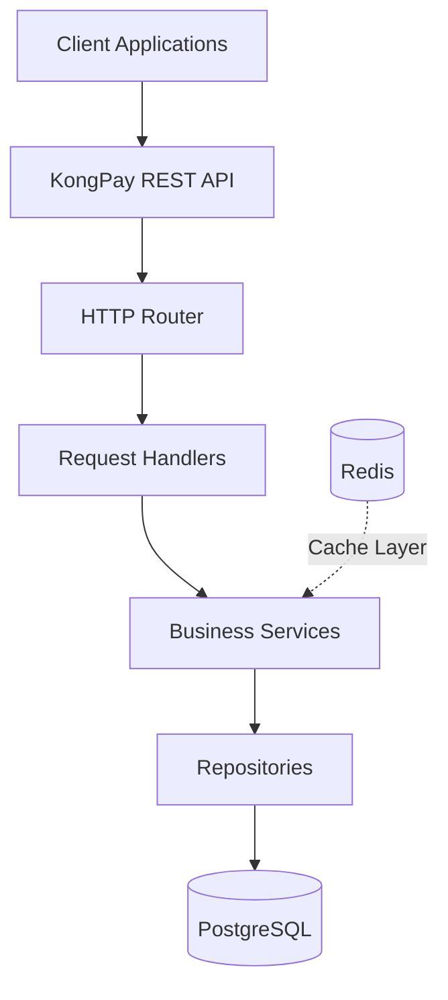

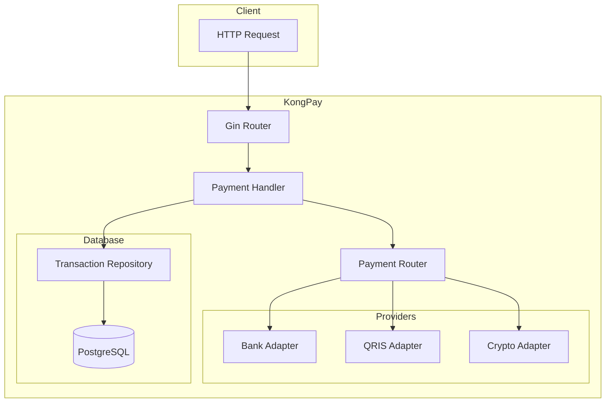

### Architecture Principles

- 🧩 Clean Architecture
- 🔄 Separation of Concerns
- 📦 Repository Pattern
- 💉 Dependency Injection
- ⚡ API-First Design
- 🔒 Secure by Design
- 📈 Horizontally Scalable

---

# 🔄 Request Processing Flow

The following sequence illustrates how a request is processed throughout the KongPay backend.

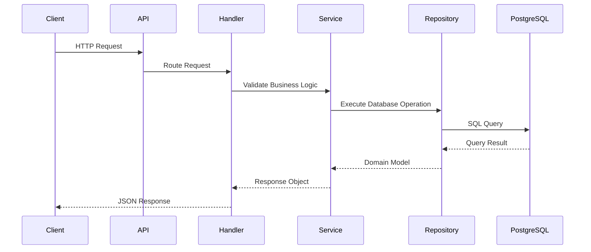

---

# ✨ Current Features

## Core Infrastructure

- ✅ RESTful API
- ✅ Clean Architecture
- ✅ Repository Pattern
- ✅ Service Layer
- ✅ Dependency Injection
- ✅ Environment Configuration
- ✅ Health Check Endpoint

## Wallet Service

- ✅ Create Wallet
- ✅ Get Wallet
- ✅ List Wallets
- ✅ Update Wallet
- ✅ Delete Wallet
- ✅ UUID Wallet Identifier
- ✅ Wallet Balance Management
- ✅ Currency Management
- ✅ Wallet Status Management

## Infrastructure

- ✅ PostgreSQL Persistence
- ✅ Redis Integration
- ✅ Docker Development Environment
- ✅ GitHub Actions CI/CD

## Financial Modules

- ✅ Wallet Infrastructure
- 🚧 Payment Engine
- 🚧 Transaction Ledger
- 🚧 Settlement Engine
- 🚧 Settlement Event Audit
- 🚧 Settlement Reconciliation
- ⏳ Merchant Service
- ⏳ Invoice Engine
- ⏳ Webhook Service

---

# ⚙ Technology Stack

| Category | Technology |
|-----------|------------|
| **Language** | Go 1.26 |
| **Framework** | Gin |
| **Database** | PostgreSQL 17 |
| **Database Driver** | pgx v5 |
| **Cache** | Redis 7 |
| **Identifiers** | Google UUID |
| **Containerization** | Docker |
| **CI/CD** | GitHub Actions |
| **API** | REST |
| **Version Control** | Git |
| **Architecture** | Clean Architecture |
| **Documentation** | Markdown + Mermaid |

# 📂 Repository Structure

KongPay follows the **Standard Go Project Layout** combined with **Clean Architecture** principles. Each package has a single responsibility, making the codebase modular, maintainable, and easy to scale.

```text
kongpay/
│
├── cmd/
│   └── kongpay/
│       └── main.go                # Application entry point
│
├── internal/
│   ├── config/                    # Configuration management
│   ├── database/                  # PostgreSQL connection
│   ├── handlers/                  # HTTP handlers
│   ├── middleware/                # Authentication & middleware
│   ├── models/                    # Domain entities
│   ├── repositories/              # Data access layer
│   ├── router/                    # API routing
│   ├── services/                  # Business logic
│   ├── settlement/                # Settlement engine
│   ├── reconciliation/            # Reconciliation engine
│   ├── audit/                     # Audit events
│   └── utils/                     # Shared utilities
│
├── migrations/                    # Database migrations
├── docker/                        # Docker configuration
├── docs/                          # Documentation
├── tests/                         # Unit & integration tests
│
├── .github/
│   └── workflows/                 # GitHub Actions
│
├── docker-compose.yml
├── go.mod
├── go.sum
└── README.md
```

---

# 🏛 Project Architecture

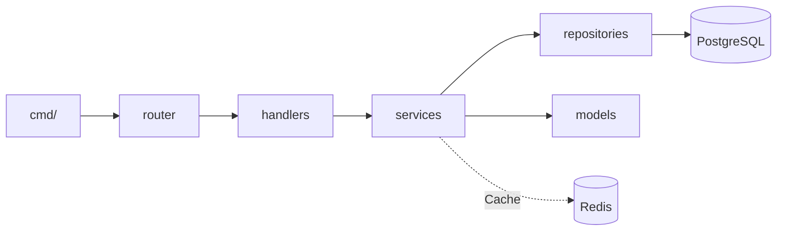

---

# 📁 Directory Overview

| Directory | Description |
|------------|-------------|
| `cmd/kongpay` | Application bootstrap and entry point |
| `internal/config` | Environment variables and application configuration |
| `internal/database` | PostgreSQL initialization and connection management |
| `internal/router` | API routing and endpoint registration |
| `internal/handlers` | HTTP request and response handlers |
| `internal/services` | Core business logic implementation |
| `internal/repositories` | Database persistence layer |
| `internal/models` | Domain entities and data models |
| `internal/middleware` | Authentication, authorization, logging, and request middleware |
| `internal/settlement` | Settlement processing engine |
| `internal/reconciliation` | Settlement reconciliation engine |
| `internal/audit` | Financial audit trail and event logging |
| `internal/utils` | Shared helper utilities |
| `migrations` | SQL database migration scripts |
| `docker` | Docker and container configuration |
| `docs` | Technical documentation and API references |
| `tests` | Unit, integration, and end-to-end tests |
| `.github/workflows` | Continuous Integration (GitHub Actions) |

---

# 📋 Layer Responsibilities

| Layer | Responsibility |
|---------|----------------|
| **API Layer** | Receives incoming HTTP requests |
| **Router Layer** | Maps endpoints to handlers |
| **Handler Layer** | Validates requests and formats responses |
| **Service Layer** | Executes business rules and orchestrates workflows |
| **Repository Layer** | Performs database operations |
| **Persistence Layer** | Stores application data in PostgreSQL |
| **Cache Layer** | Accelerates frequently accessed data using Redis |

---

# 🔄 Dependency Flow

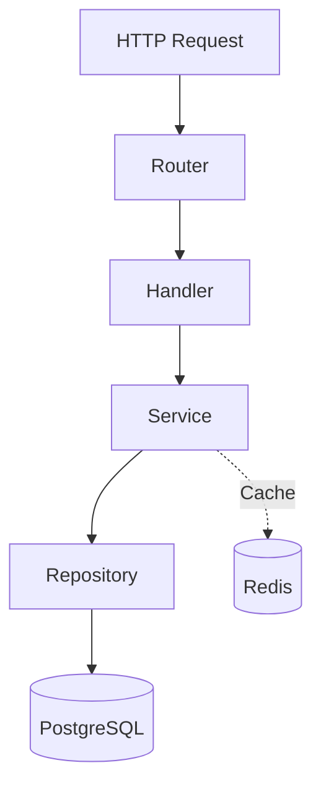

---

# 🗄 Database Modules

The current KongPay data model consists of the following core modules:

| Module | Purpose |
|---------|----------|
| `users` | User identity and account information |
| `wallets` | Digital wallet management |
| `transactions` | Payment transaction records |
| `ledger_entries` | Double-entry accounting ledger |
| `settlements` | Settlement batches |
| `settlement_events` | Settlement lifecycle events |
| `settlement_reconciliations` | Reconciliation results and differences |

---

# 🧩 Design Principles

KongPay is designed around several engineering principles:

- 🧩 Clean Architecture
- 🔄 Separation of Concerns
- 📦 Repository Pattern
- 💉 Dependency Injection
- 🔒 Secure by Design
- ⚡ API-First Development
- 📈 Horizontally Scalable
- 🧪 Testable Components
- ☁️ Cloud-Native Ready

# 🗄 Database Schema

KongPay uses **PostgreSQL** as its primary relational database to provide reliable transactional consistency, data integrity, and long-term scalability.

The Wallet Service currently stores digital wallet information using the following schema.

```sql
CREATE TABLE wallets (
    id UUID PRIMARY KEY,
    user_id UUID NOT NULL,
    balance NUMERIC(20,2) NOT NULL DEFAULT 0,
    currency VARCHAR(10) NOT NULL,
    status VARCHAR(20) NOT NULL DEFAULT 'ACTIVE',
    created_at TIMESTAMP NOT NULL DEFAULT NOW(),
    updated_at TIMESTAMP NOT NULL DEFAULT NOW()
);

CREATE INDEX idx_wallets_user_id
ON wallets(user_id);

CREATE INDEX idx_wallets_status
ON wallets(status);
```

---

# 🗂 Entity Relationship

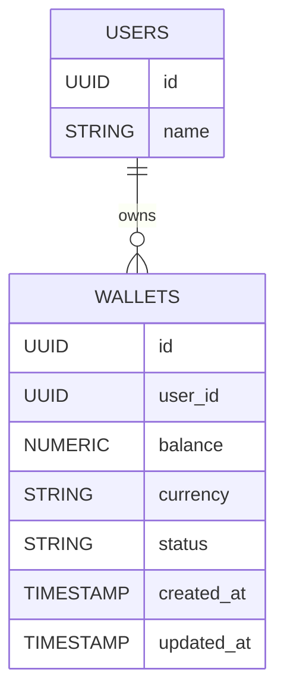

---

# 📊 Wallet Table

| Column | Type | Description |
|---------|------|-------------|
| `id` | UUID | Primary key |
| `user_id` | UUID | Wallet owner |
| `balance` | NUMERIC(20,2) | Current wallet balance |
| `currency` | VARCHAR(10) | Wallet currency (IDR, USD, USD, etc.) |
| `status` | VARCHAR(20) | ACTIVE, BLOCKED, CLOSED |
| `created_at` | TIMESTAMP | Record creation timestamp |
| `updated_at` | TIMESTAMP | Last modification timestamp |

---

# ⚡ Database Indexes

To improve lookup performance, the Wallet Service currently defines the following indexes.

```sql
CREATE INDEX idx_wallets_user_id
ON wallets(user_id);

CREATE INDEX idx_wallets_status
ON wallets(status);
```

| Index | Purpose |
|---------|----------|
| `idx_wallets_user_id` | Fast lookup by wallet owner |
| `idx_wallets_status` | Efficient filtering by wallet status |

---

# 📈 Wallet Lifecycle

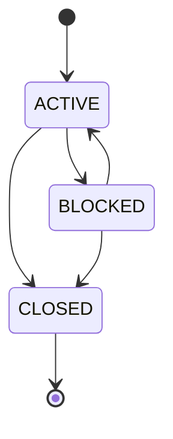

---

# 📡 REST API

## Base URL

```text
/api/v1
```

---

# 🎯 Endpoint Matrix

| Method | Endpoint | Description | Status |
|---------|----------|-------------|:------:|
| GET | `/health` | Application health check | ✅ |
| POST | `/wallets` | Create Wallet | ✅ |
| GET | `/wallets` | List Wallets | ✅ |
| GET | `/wallets/{id}` | Get Wallet | ✅ |
| PUT | `/wallets/{id}` | Update Wallet | ✅ |
| DELETE | `/wallets/{id}` | Delete Wallet | ✅ |

---

# 🔄 Wallet CRUD Flow

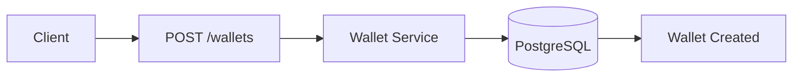

---

# 🧪 API Example

## 🚀 Create Wallet

### Request

```http
POST /api/v1/wallets
Content-Type: application/json
```

```json
{
  "user_id": "550e8400-e29b-41d4-a716-446655440000",
  "currency": "IDR"
}
```

---

### Response

```json
{
  "id": "11c58304-cffc-4073-90a9-a2e6b7aac7e2",
  "user_id": "550e8400-e29b-41d4-a716-446655440000",
  "balance": 0,
  "currency": "IDR",
  "status": "ACTIVE",
  "created_at": "2026-08-02T09:42:31.691793Z",
  "updated_at": "2026-08-02T09:42:31.691793Z"
}
```

---

# 📥 Example Response Codes

| HTTP Code | Meaning |
|-----------|---------|
| **200** | Success |
| **201** | Resource Created |
| **400** | Invalid Request |
| **404** | Wallet Not Found |
| **409** | Duplicate Resource |
| **500** | Internal Server Error |

---

# 🔮 Future Database Modules

As KongPay evolves into a complete digital payment platform, the database schema will expand with additional financial modules.

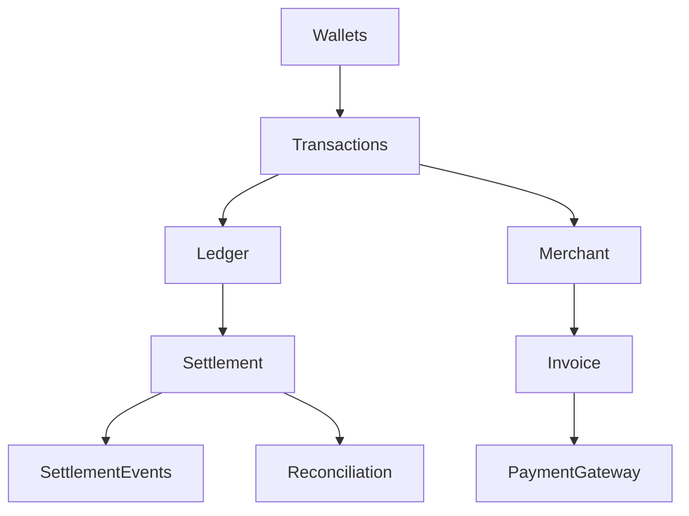

Future tables:

- users
- wallets
- merchants
- merchant_accounts
- invoices
- transactions
- ledger_entries
- settlements
- settlement_events
- settlement_reconciliations
- webhooks
- notifications
- audit_logs

# 📋 Wallet API Operations

The Wallet Service exposes a RESTful API for creating, retrieving, updating, and managing digital wallets.

---

## 📑 List Wallets

Retrieve all registered wallets.

### Request

```http
GET /api/v1/wallets
```

or

```bash
curl http://localhost:8080/api/v1/wallets
```

### Response

```json
[
  {
    "id": "11c58304-cffc-4073-90a9-a2e6b7aac7e2",
    "user_id": "550e8400-e29b-41d4-a716-446655440000",
    "balance": 0,
    "currency": "IDR",
    "status": "ACTIVE",
    "created_at": "2026-08-02T09:42:31.691793Z",
    "updated_at": "2026-08-02T09:42:31.691793Z"
  }
]
```

---

## 🔍 Get Wallet

Retrieve a wallet by its unique identifier.

### Request

```http
GET /api/v1/wallets/{id}
```

```bash
curl http://localhost:8080/api/v1/wallets/11c58304-cffc-4073-90a9-a2e6b7aac7e2
```

---

## ✏️ Update Wallet

Update wallet information.

### Request

```http
PUT /api/v1/wallets/{id}
```

```json
{
  "currency": "USD",
  "balance": 100000,
  "status": "ACTIVE"
}
```

```bash
curl -X PUT http://localhost:8080/api/v1/wallets/11c58304-cffc-4073-90a9-a2e6b7aac7e2 \
-H "Content-Type: application/json" \
-d '{
  "currency":"USD",
  "balance":100000,
  "status":"ACTIVE"
}'
```

---

## 🗑 Delete Wallet

Delete an existing wallet.

### Request

```http
DELETE /api/v1/wallets/{id}
```

```bash
curl -X DELETE http://localhost:8080/api/v1/wallets/11c58304-cffc-4073-90a9-a2e6b7aac7e2
```

### Response

```json
{
  "message":"wallet deleted successfully"
}
```

---

# 🚀 Getting Started

Getting KongPay up and running takes only a few minutes.

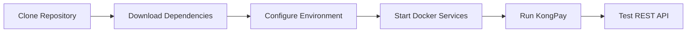

---

## 🛠 Requirements

| Software | Version |
|----------|----------|
| Go | 1.26+ |
| PostgreSQL | 17+ |
| Redis | 7+ |
| Docker | Latest |
| Docker Compose | Latest |
| Git | Latest |
| curl | Latest |

---

## 📥 Clone Repository

```bash
git clone https://github.com/kongali1720/KongPay.git

cd KongPay
```

---

## 📦 Install Dependencies

```bash
go mod download
```

---

## ⚙ Configure Environment

Create a `.env` file.

```env
APP_NAME=KongPay
APP_ENV=development
PORT=8080

DB_HOST=localhost
DB_PORT=5432
DB_NAME=kongpay
DB_USER=postgres
DB_PASSWORD=postgres
DB_SSLMODE=disable
```

> ⚠️ Never commit production secrets or credentials into Git repositories.

---

## 🐳 Start Infrastructure

```bash
docker compose up -d
```

Verify running containers.

```bash
docker ps
```

---

## ▶ Run KongPay

```bash
go run ./cmd/kongpay
```

Application URL

```text
http://localhost:8080
```

---

## ❤️ Health Check

```bash
curl http://localhost:8080/health
```

---

# 🐳 Docker Development Infrastructure

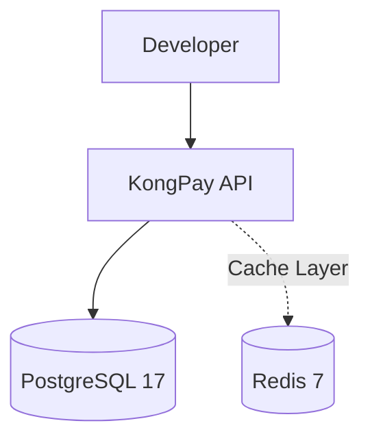

Useful commands

```bash
docker compose up -d
docker ps
docker compose logs
docker compose down
```

---

# 🛠 Development Workflow

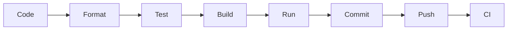

Format

```bash
go fmt ./...
```

Run Tests

```bash
go test ./...
```

Build

```bash
go build ./...
```

Run

```bash
go run ./cmd/kongpay
```

---

# 🔁 Git Workflow

```bash
git status

git pull --rebase origin main

git add .

git commit -m "feat(wallet): complete wallet CRUD"

git push origin main
```

---

# ⚙ GitHub Actions

## Current Pipeline

- ✅ Dependency Download
- ✅ Go Build
- ✅ Go Test

### Planned Improvements

- 🔄 gofmt Validation
- 🔄 go vet
- 🔄 golangci-lint
- 🔄 Test Coverage Reports
- 🔄 Docker Image Publishing
- 🔄 Automated Release Workflow

---

# 🔐 Security Roadmap

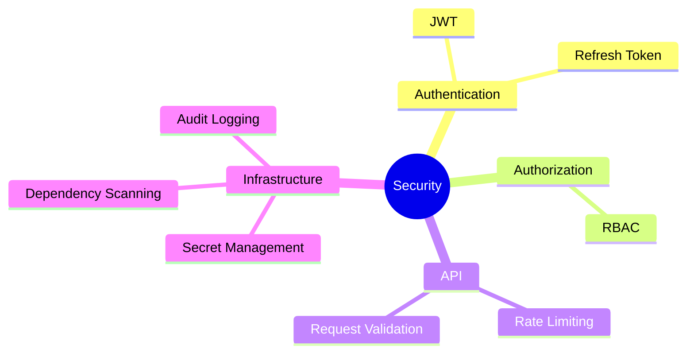

---

# 🗃 Database Migration Roadmap

```text
migrations/

├── 001_create_wallets.sql
├── 002_create_merchants.sql
├── 003_create_transactions.sql
├── 004_create_ledger.sql
├── 005_create_settlements.sql
├── 006_create_reconciliation.sql
└── ...
```

---

# 🧪 Testing Roadmap

- ✅ Unit Tests
- 🚧 Repository Tests
- 🚧 Service Tests
- 🚧 Handler Tests
- 🚧 Integration Tests
- 🚧 End-to-End Tests
- 🚧 Authentication Tests
- 🚧 Performance Tests

---

# 🧭 Product Roadmap

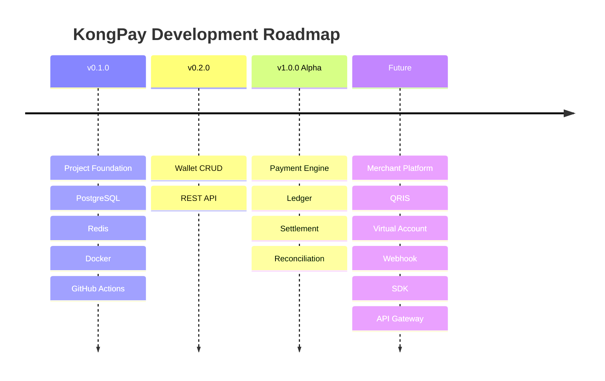

---

# 🌐 KongPay Ecosystem

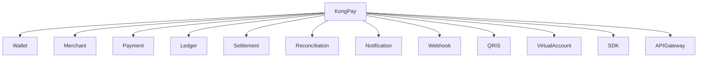

---

# 🤝 Contributing

We welcome developers, researchers, and open-source enthusiasts to contribute to KongPay.

You can contribute by:

- 🚀 Opening Pull Requests
- 🐞 Reporting Issues
- 💡 Suggesting Features
- 📖 Improving Documentation
- 🧪 Writing Tests
- 🔒 Enhancing Security

Before submitting a Pull Request:

```bash
go fmt ./...
go test ./...
go build ./...
```

---

# 🛡 Responsible Security Reporting

If you discover a security vulnerability, please report it **privately** before creating a public issue.

Responsible disclosure allows maintainers to investigate and resolve security issues before public publication.

---

# 📜 License

This project is licensed under the **MIT License**.

See the `LICENSE` file for more information.

---

# ❤️ Support KongPay

<div align="center">

### ☕ Support Open Source Development

If KongPay has helped your learning or software development journey, consider supporting future development.

<a href="https://www.paypal.com/paypalme/bungtempong99">

</a>

</div>

---

# 🌟 Project Vision

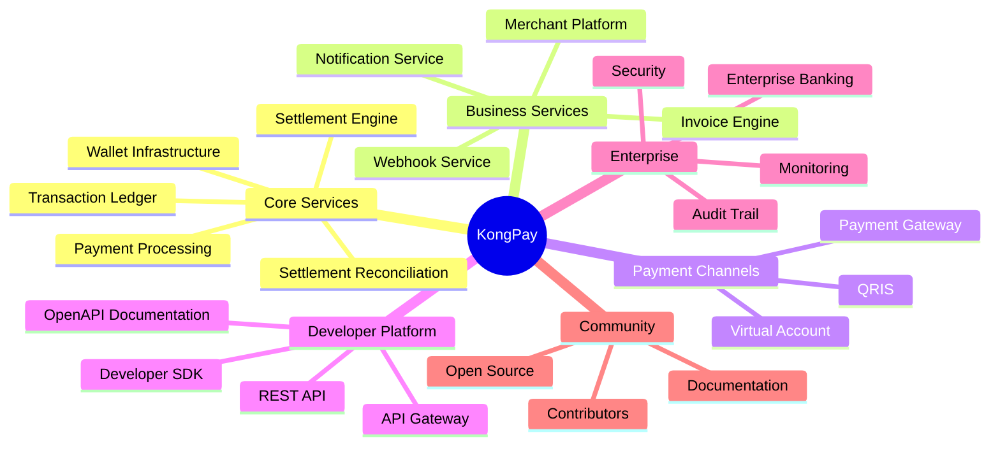

---

<div align="center">

# ❤️ Built with Go by **KONGALI1720**

### Autonomous Digital Financial Infrastructure


### 🇮🇩 Made with ❤️ in Indonesia

</div>
